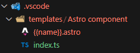
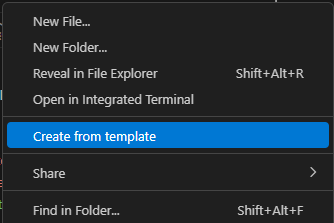
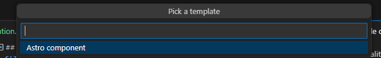
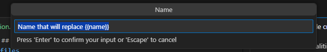

## use template files for new files

When creating files with the same structures over and over again, it's handy to be able to generate some boilerplate code on file creation.\
To do this, I use the extension [File Template](https://marketplace.visualstudio.com/items?itemName=rhangai.file-template) which allows exactly to do so.\

The functionalities are limited as of v0.0.7, but it's enough for simple Astro Components boilerplate following the dir structure explained in [best practices 1 - components and folders organization](<1 - components and folders organization.md>).\

We need to define template files inside `.vscode/templates/` for single files templates, or a directory containing the template files to allow us to create multiple files at once.\

For a simple `Astro component` template this is the structure of the template\
\
where `{{name}}` reflects what you type when writing the name when prompted by the extension.\

When right clicking on the file explorer inside VSCode you get the following new option 

Following the prompts you get asked to choose what template to use\

and what name to give as input to the created content\

