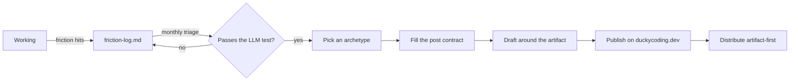

# Content Roadmap

The platform is finished. The content is not: three posts, all from June 2025,
on a site with a build-time search index, an SSR search route, JSON-LD, RSS and
a design system. This document is the plan for closing that gap.

It exists to answer three questions that were blocking writing:

1. **Why does a post exist?** → the editorial line
2. **How do I find things to write about?** → the friction log
3. **How do I say it, and where do I put it?** → archetypes and distribution

---

## 1. The reader

**Developers roughly two years behind me.**

This single decision resolves the "this is too trivial" objection, so it comes
first. What feels obvious is obvious *to you, now*. To someone two years back it
is the thing they are currently stuck on, and you have the advantage of
remembering being stuck on it — which someone ten years ahead does not.

Calibrate every post against that reader, not against the most senior person who
might read it.

---

## 2. The editorial line

> Every post must contain at least one of: **a measurement you ran, a behavior
> you tested, a system you built, or a failure you hit.**
>
> If a post could be generated by an LLM without access to your machine, don't
> write it.

**Model:** `image-srcset-and-sizes-attributes.mdx` — *"I couldn't find a clear
and definitive explanation … so I decided to test and explain them myself"* —
shipping recorded Chrome and Firefox videos of the same markup resolving
differently. The fact was ordinary. The evidence did not exist anywhere else.

**Anti-model:** a generic "what is srcset" explainer.

### The two objections, resolved

| Objection | What's actually going on | The fix |
|---|---|---|
| *"Too trivial"* | You're valuing the **fact**, which is commodity. The post's value is the **evidence you generated**. | Don't write the fact. Write the artifact — the recording, the measurement, the before/after. |
| *"Too unknown"* | You're reaching for the **tutorial** genre, the one an LLM writes better than you. | Don't write *about* the unfamiliar thing. Build with it, get surprised, write the surprise. |

Neither objection survives contact with the rule: you never publish what you
know, you publish what you produced.

---

## 3. The post contract

Fill this in **before** writing. It is the "clear goal" for the post; if it
won't fill in, the idea stays in the friction log.

> For **[reader]** who **[situation]**, this post shows **[evidence]** so they
> can **[outcome]**.
>
> An LLM without access to my machine could not produce **[the artifact]**.

If the last line is empty, it is not a post yet.

---

## 4. Where topics come from

Topics are not found by sitting down to think of topics. That reliably fails.
They are produced constantly while working and then forgotten within days.

**`friction-log.md`** (next to this file) is the capture mechanism. Append one
line — no more — whenever any of these fire:

- you searched for something and there was no clear answer
- something took ~30+ minutes that should have taken 5
- you chose between two options and the reason wasn't obvious
- something behaved differently than you expected

**Capture without judging.** You are the worst possible judge of whether your own
friction is interesting, in the moment it happens. Triage monthly, not at write
time. The log is already seeded with real entries from a single afternoon of
maintenance work — that is the expected rate.

---

## 5. Post archetypes

Five shapes. Pick one before drafting so the structure is never the blocker.

### Test report
Settle a question the documentation doesn't. Structure: the question → why
existing answers were unsatisfying → the setup → what actually happened → what
it means. **Artifact: the recording or measurement.**

### Decision record
Justify a trade-off under real constraints. Structure: the constraint → the
options → what you picked and what it cost → what would change your mind.
**Artifact: the constraint made concrete (a number, a limit, a failure mode).**

### Failure narrative
The wrong turns, not just the destination. Structure: what you expected → each
approach and why it broke → the actual cause → the fix. Survives LLMs precisely
because the wrong turns were yours. **Artifact: the error, verbatim.**

### Build log / showcase
Turn a project card into a story. Structure: what it does → the interesting
constraint → one thing that was harder than expected → link to it running.
**Artifact: the thing, live.**

### Controlled comparison
Same problem, one variable changed. Structure: the fixed backend → this
implementation → the numbers (bundle size, LoC, time-to-feature) → what the
difference actually buys. **Artifact: the comparison table.**

---

## 6. Topic decisions

All six topics are **KEEP**. Four currently have no posts, so keeping them is a
commitment: each empty topic needs a funded backlog item, or its page reads as
abandonment.

| Topic | Decision | Funded by |
|---|---|---|
| Astro | KEEP | posts 1, 2, 3, 5 |
| HTML | KEEP | has 2 posts |
| TypeScript | KEEP | **post 4** (new — this is the commitment) |
| CSS | KEEP | **post 7** (new — this is the commitment) |
| React | KEEP | post 8 (series opener) |
| LeetCode | KEEP | post 10 |

Pruning is no longer blocked — plan 003 fixed the orphan-cleanup path, so
deleting a topic JSON is now safe. If a commitment above goes unmet after two
cycles, delete that topic's JSON rather than leaving an empty page live.

---

## 7. Backlog

Ordered roughly cheapest-first. Every item cites the in-repo evidence it is
built from; **additions must do the same.**

1. **"My blog runs a database it doesn't need — and why I'd do it again"**
   *Decision record.* Build-time Turso sync feeding one SSR route. Evidence:
   `src/db/sync/buildSync.ts`, the `db-sync` integration.
2. **"One SSR page on an otherwise static site: caching /search on Netlify's CDN"**
   *Decision record.* Evidence: `src/pages/search.astro` headers and the verified
   durable-cache semantics — a year-long `s-maxage` that is correct only because
   deploys invalidate.
3. **"I let an AI audit my blog and it found a bug that deletes my database rows"**
   *Failure narrative.* Evidence: the audit plans and their execution, in git
   history on the `chore/advisor-plans` branch (the `plans/` folder was deleted
   once executed); orphan cleanup keyed on "synced" rather than "seen", so a
   typo in frontmatter deleted the row. Fix: `fix(db): keep posts whose
   frontmatter fails validation`.
4. **"noUncheckedIndexedAccess: the strict flag that finds real bugs"** ← *funds TypeScript*
   *Test report.* Evidence: `tsconfig.json`, and `getVisiblePages` where
   `sorted[i]!` silenced the exact check that flag exists to raise.
5. **"Enforcing architecture with ESLint: no DB access outside the service layer"**
   *Build log.* Evidence: the `no-restricted-imports` rules in `eslint.config.js`.
6. **"Running TypeScript directly in Node: what erasableSyntaxOnly forbids"**
   *Test report.* Evidence: `node ./src/db/migrate.ts` in package.json scripts,
   `erasableSyntaxOnly: true`, the husky hooks running `.ts` with no build step.
7. **"A comic-book design system in Tailwind v4"** ← *funds CSS*
   *Build log.* Evidence: the `shadow-comic` / `border-comic` utilities, the
   `data-theme` swap, the 60-30-10 rule in `docs/stable/development/styling/`.
8. **"Task manager, same backend, frontend #1: React"** ← *funds React*
   *Controlled comparison,* series opener. Evidence: `src/data/projects.ts`
   describes it as "an incremental frontend laboratory".
9. **"Frontend #2: Astro (yes, for an app)"**
   *Controlled comparison.* Real numbers against post 8.
10. **"A LeetCode problem where my first three approaches were wrong"** ← *funds LeetCode*
    *Failure narrative.* Evidence: the LeetCode repo.
11. **"What building a CLI templater taught me about inquirer and Bun"**
    *Build log.* Evidence: the CLI Templater project card.
12. **"JSON-LD @graph on a real site: what changed in my search snippets"**
    *Test report.* Evidence: the json-ld refactor. **Schedule last** — needs
    weeks of Search Console data to have a result worth reporting.
13. **"Two years of building a blog before writing on it: what I'd cut"**
    *Failure narrative.* The welcome post is the foil.

---

## 8. Cadence

**One post per month.**

Recorded here so git history keeps it honest. Two consecutive misses is the
signal to cut scope per post — shorter, one artifact, same bar — not to abandon
the cadence.

Drafts do not need to be sequential: the friction log accumulates continuously,
and monthly triage picks whatever is most ready.

---

## 9. Cross-linking projects and posts

The gateway only works in both directions.

- Every project gains a **"read the story"** link once its showcase post ships.
  `src/data/projects.ts` already carries an optional
  `secondaryLinks: { label, href }[]`, rendered by `ProjectGrid.astro` outside
  the card so there are no nested anchors — one array entry, no component change.
- Every showcase post links back to `/my-projects`.

First candidate: **post 11** (CLI Templater), the cheapest project→post pair.
Wiring happens when that post ships, not before.

---

## 10. Distribution

Optimising for two things: **dev community reach** and **professional signal**.

### The artifact-first rule

Every post must yield **one shareable artifact** — a video, a before/after, a
table, a diagram, an error message. That artifact is what gets posted; the blog
is the destination, not the pitch. A link to "my new blog post" travels nowhere.
Two browsers disagreeing on video travels.

If a post has no artifact, it hasn't met the editorial line either. The rules
are the same rule.

### Channels

| Channel | Use for | How |
|---|---|---|
| **duckycoding.dev** | Everything | Always the canonical URL. Publish here first. |
| **dev.to / Hashnode** | Test reports, failure narratives | Syndicate ~1 week later with `rel=canonical` pointing home, so search credit stays here. |
| **Reddit** | Failure narratives, comparisons | Subreddit-appropriate only (r/webdev, r/astrojs, r/typescript). Post the finding as a post, with the link as supporting evidence. Bare link drops get removed and earn nothing. |
| **LinkedIn** | Build logs, showcases, comparisons | The professional-signal channel. Lead with the artifact, 3-5 sentences of framing, self-contained enough to be worth reading without the click. |
| **X** | Everything with a visual | Thread with the artifact as the first media item. |
| **Hacker News** | Rare | Only genuinely novel work, and `Show HN` for finished projects. Most posts do not fit; forcing them wastes the one shot. |

### Publish checklist

- [ ] Post contract filled, including the artifact line
- [ ] One shareable artifact exported and embedded
- [ ] Frontmatter: `topicTitle` set to a KEEP topic, `tags`, `summary`, `createdAt`
- [ ] Banner image added and synced (banner images are DB-backed)
- [ ] Links back to `/my-projects` if it's a showcase
- [ ] Deploy, then confirm `/search` finds it — the index only updates on deploy
- [ ] Syndicate with `rel=canonical` after ~1 week

### Honest caveat

The editorial and capture sections are grounded in evidence from this repo. This
distribution section is **known-good practice, not measured results** — there is
no audience data yet. Treat the channel table as a starting hypothesis and let
the first six posts correct it. Anyone promising reliable traction mechanics is
guessing.

---

## Maintenance

- Triage the friction log **monthly**, at the same time as picking the next post.
- Revisit this document when the backlog is half-shipped or six months pass,
  whichever comes first.
- Additions to the backlog must cite in-repo evidence, exactly like the existing
  entries. That constraint is what keeps the bar where it is.
