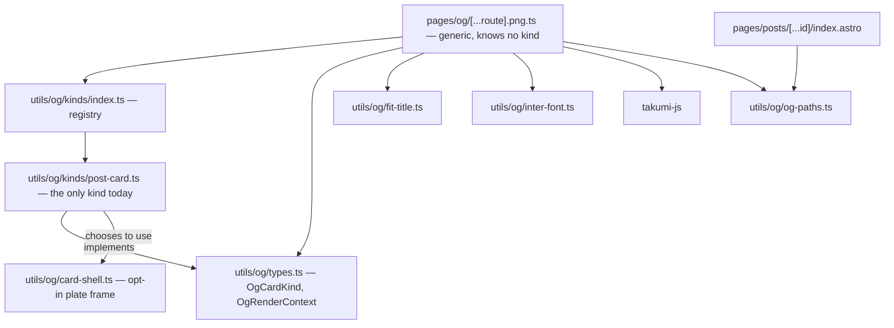

# Build-time OG image generation — design spec

Workstream B of four. A (UI redesign) is merged; C (performance) and D (duck
character baseline) remain.

## Context

Every page currently serves an unoptimised source image as its social card:

| Page | `og:image` | Weight |
|------|-----------|--------|
| `/posts/welcome-to-duckycoding` | the post banner PNG | **2,136 KB** |
| `/posts/image-srcset-and-sizes-attributes` | the post banner PNG | **2,188 KB** |
| `/posts/avoid-self-referencing-links` | the post banner PNG | 484 KB |
| `/`, `/blog`, `/memes` | the site logo PNG | 420 KB |
| `/topics/astro` | the topic logo PNG | — |

Measured on the production build: **6,864 KB of PNG ships in `dist`, of which
4,808 KB — 70% — is the three post banners**, referenced only because
`og:image` points at the original asset. Every visible `` on the site
already uses optimised avif; these originals exist purely for social scrapers.

Two problems, then. The cards are heavy, and they are also *wrong*: a 3:2 banner
or a square logo is not a 1.91:1 social card, so previews get letterboxed or
cropped.

This spec covers **blog posts only**. That captures 70% of the waste and is the
content people actually share. Other page types keep the logo until a later pass.

## Scope

**In scope:** a generated 1200×630 PNG per published blog post, referenced as
`og:image` / `twitter:image`.

**Out of scope, deliberately:**
- Cards for the home page, `/blog`, `/topics`, `/memes`, `/my-projects`, `/404`
  and `/search`. They keep the current logo fallback.
- The **hybrid** strategy — resizing existing artwork where it exists rather than
  generating over it. This was judged the better end state during design but more
  complex; recorded as a follow-up.
- Build-time caching of rendered cards. With three posts the render cost is
  negligible; caching would be complexity without benefit. Revisit at tens of posts.
- The 420 KB logo original. It is referenced by
  `src/utils/json-ld/publisher.ts` for `Organization.logo`, which legitimately
  wants a real logo URL, so it ships regardless of this work.

## The card

Confirmed against rendered mockups at true 1200×630 using the real Inter woff2.

```
┌──────────────────────────────────────────────────┐  1200 × 630
│  28px accent2-100 margin                         │
│  ┌────────────────────────────────────────────┐  │
│  │ [/posts/slug]  ← mono-ish chip, accent3    │  │  plate: white,
│  │                                            │  │  8px secondary border,
│  │   Title, size computed to fit              │  │  12px flat shadow,
│  │                                            │  │  52px padding,
│  │ [topic] [first tag] 5 min read      ((duck))│ │  overflow hidden
│  └────────────────────────────────────────────┘  │
└──────────────────────────────────────────────────┘
```

| Element | Spec |
|---------|------|
| Canvas | 1200×630, PNG |
| Outer margin | 28px, `--color-accent2-100` (`#ccf9ff`) |
| Plate | `#fff`, 8px `--color-secondary` border, `12px 12px 0 0` shadow, 52px padding, `overflow: hidden` |
| Layout | flex column, `gap: 26px`: slug row (auto) → title row (`flex: 1`, **explicit height**) → meta row (auto) |
| Slug chip | `accent3` fill, 5px border, 28px, 700 |
| Title | 900 weight, `line-height: 1.04`, `letter-spacing: -0.03em`, size computed (see below) |
| Meta row | topic chip (`accent`) + first-tag chip (`accent2`) + read time as plain text, 30px/800 |
| Chips | 6px border, `8px 8px 0 0` shadow, 12px/28px padding, 32px/800, `white-space: nowrap` |
| Watermark | logo at 400px, `opacity: 0.16`, `right: -85px; bottom: -105px`, clipped by the plate |
| Dot texture | `radial-gradient` dot at 3px on a 28px grid, 50% of `secondary`, fading out by 290px from the top |

### Label rules

The second chip is **the first tag that is not the topic**. This is not a
nicety — with a naive "topic + `tags[0]`" rule, all three current posts render the
same word twice:

| Post | `topicTitle` | `tags[0]` | Second chip should be |
|------|--------------|-----------|----------------------|
| image-srcset… | HTML | HTML | `image tag` |
| welcome-to-duckycoding | Astro | Astro | `SQLite` |
| avoid-self-referencing… | HTML | HTML | `a18y` |

If no tag differs from the topic, render only the topic chip and the read time.
The meta row is a flex row, so it does not break.

Tags longer than 18 characters are truncated with an ellipsis, because chips are
`nowrap`. The longest tag today is `Web Development` (15), so this never fires
yet.

`timeToRead` is required by `PostContentSchema`, so read time is always present.

### Title sizing

Size is **computed by bisection** between 40px and 136px: the largest size at
which the wrapped text fits both the width and the height of the title box.
Truncation on a word boundary is a backstop that only applies if the text does
not fit even at 40px.

Measured against the real font, this yields:

| Post | Characters | Size |
|------|-----------|------|
| Welcome to DuckyCoding | 22 | 128px |
| Understanding HTML5 image attributes… | 54 | 86px |
| How I avoid self-referencing links… | 79 | 77px |
| (synthetic stress test) | 163 | 52px |

Even at 163 characters the backstop never fires, so with real content nothing is
ever truncated. Fixed size steps were tried first and rejected: they overflowed,
because they were tuned by eye.

**Two constraints learned by getting this wrong during design.** Both must hold
or the layout silently breaks:

1. **The title box's height must be determinate, not content-driven.** With an
   auto height the box grows with the text, so every candidate size "fits" and
   bisection always returns the maximum. In this card the plate is `height: 100%`
   of a fixed canvas, so the title row's `flex: 1` already resolves to a bounded
   height — no extra fixed height is needed, and adding one would be redundant.
   The rule matters because it is what broke the alternative layout explored
   during design, whose plate was auto-sized.
2. **The watermark must be excluded from overflow checks.** It is absolutely
   positioned and *intended* to bleed past the plate; including it in
   `scrollWidth`/`scrollHeight` comparisons reports healthy cards as broken.

## Architecture

Pure logic is separated from the runner, because the runner is the only part with
technical uncertainty.

Nothing about the post card is baked into the pipeline. There is **one shared
shell** and **one card kind** that plugs into it; adding a kind later means
implementing three small functions and adding a registry entry, not touching the
renderer, the fonts, the fitting or the route.



The route builds an `OgRenderContext` — width, height, `fitTitle`, logo path —
and hands it to whichever kind owns the requested path. It never sees card
content. `card-shell` sits off to the side with no dependency on the contract,
which is what makes it optional.

### The seam

**A kind owns its own HTML.** There is deliberately no shared content type: the
fields a card needs are exactly the thing that varies between kinds, so fixing
them up front would be the wrong abstraction. A meme card may want an embedded
image and no chips; a generic page card may want only a title; a topic card may
want a post count. None of them should be forced through a post-shaped hole.

What *is* shared is the pipeline — enumerate, render, encode, write — plus a set
of opt-in helpers.

```ts
/** Shared tools handed to a kind at render time. */
export interface OgRenderContext {
  readonly width: number;   // 1200
  readonly height: number;  // 630
  /** Largest size at which `text` fits the given box, plus truncation backstop. */
  fitTitle(text: string, box: { width: number; height: number }, opts?: FitOptions): FitResult;
  /** Absolute path of the logo, for embedding as a watermark. */
  readonly logoPath: string;
}

/** One card type. `TEntry` is whatever that kind enumerates — its own shape. */
export interface OgCardKind<TEntry> {
  /** URL segment and output directory: /og/<kind>/<id>.png */
  readonly kind: string;
  listEntries(): Promise<TEntry[]>;
  entryId(entry: TEntry): string;
  /** The complete HTML for this card. The kind decides its own layout. */
  renderHtml(entry: TEntry, ctx: OgRenderContext): string;
}
```

`card-shell.ts` is then an **opt-in helper, not a contract**: a function that
draws the neo-brutalist frame agreed in design — canvas, 28px margin, white
plate, dot texture, watermark — and takes its own options type. The post card
calls it. A future kind may call it with different options, or ignore it entirely
and emit its own HTML. Nothing forces the frame.

| File | Responsibility |
|------|----------------|
| `src/utils/og/types.ts` | `OgCardKind` and `OgRenderContext`. The whole extension contract — no content shape. |
| `src/utils/og/card-shell.ts` | Opt-in helper that draws the approved plate frame from its **own** options type. Escapes all interpolated text. Pure. |
| `src/utils/og/fit-title.ts` | Given text, a box and a measuring function, return the size and possibly-truncated text. Pure. |
| `src/utils/og/kinds/post-card.ts` | `OgCardKind` for blog posts. Defines its own content shape internally, maps title/topic/tag/read time, and calls `card-shell`. **All post-specific knowledge lives here and nowhere else.** |
| `src/utils/og/kinds/index.ts` | `OG_CARD_KINDS` — the registry. One entry today. |
| `src/utils/og/og-paths.ts` | Single source of truth for `/og/<kind>/<id>.png`, URL and filesystem path. |
| `src/utils/og/inter-font.ts` | Locate the Inter woff2 that Astro downloaded. Throws if absent. |
| `src/pages/og/[...route].png.ts` | Generic: `getStaticPaths` walks the registry; `GET` resolves the kind, calls `renderHtml`, encodes the PNG. `prerender = true`. Knows nothing about posts. |

A single generic route rather than one file per kind — the same shape
`astro-og-canvas`'s `OGImageRoute` uses, where a `pages` map drives one route.

### What adding a kind actually costs

Write `kinds/<name>-card.ts` implementing four members, add it to
`OG_CARD_KINDS`, and point that page's `buildPageSeo` at
`ogCardUrl('<name>', id)`. Font loading, fitting, encoding, output paths and the
route are untouched.

Whether the new kind reuses `card-shell` is *its* decision. A meme card that
composites the meme image behind the title would simply not call it — and would
need no change anywhere else, because no shared type describes what a card
contains.

The cost of this looseness is that two kinds could drift visually. That is
accepted: the alternative is a universal content type that would have to grow a
field for every new idea, which is how these abstractions rot.

### Why an endpoint

This is the established pattern in the Astro ecosystem: `astro-og-canvas` — by an
Astro core maintainer, used by Starlight — exposes `OGImageRoute`, which is
exactly `getStaticPaths` + `GET`, and every independent satori-based tutorial uses
the same shape. An integration hook also exists in the wild
(`astro-og-image`) but is the minority approach.

The endpoint gives us content sync for free via `getStaticPaths`, and the route
*is* the output path, so no URL convention has to be agreed between two places.

**Which identifier.** The card must be keyed off the *same* value the post route
uses, or the two will disagree for any post stored as a directory. That value is
`entry.id` from `getCollection('posts')` — `src/pages/posts/[...id]/index.astro:54`
passes `params: { id: decodeURI(entry.id) }`, and one post today is a directory
(`avoid-self-referencing-links/index.mdx` → id `avoid-self-referencing-links`).
`og-paths.ts` therefore takes that same `id` and applies the same `decodeURI`.

**Documented fallback.** `takumi-js` loads a native Rust binding. If that misbehaves
inside Vite's SSR pipeline, move only the runner into an `astro:build:done`
integration hook in `astro.config.mjs`, following the existing `db-sync`
precedent — `src/db/sync/buildSync.ts` is deliberately written to avoid Vite and
path aliases for this reason. The pure modules are unaffected, so this is a
runner swap, not a rewrite.

### Why Takumi

- **Consumes woff2 directly**, which is exactly what Astro's font pipeline
  produces (`.astro/fonts/font-inter-100-900-normal-latin-*.woff2`). Satori
  cannot read woff2, so it would force vendoring a separate Inter TTF and risk
  drifting from the site's actual font.
- **Accepts HTML strings**, so no JSX or React toolchain — which the project's
  "no React" rule would otherwise make awkward.
- Single engine: JSX/HTML in, encoded PNG out, with no separate SVG rasterisation
  step.
- Supports everything the card needs: `box-shadow`, `opacity`, absolute
  positioning, `z-index`, `radial-gradient`, `calc()`, transforms.
- MIT OR Apache-2.0. Native bindings for macOS, Linux glibc and musl, and
  Windows, on x64 and ARM64 — so both local macOS ARM and Netlify's Linux x64
  are covered — with a WASM fallback bundled in the same package.

**Known risk:** `takumi-js` first published 2026-03-26 and has shipped 119
versions since, currently 2.6.2. It is actively maintained but young and
fast-moving, so pin the exact version and expect breaking changes between majors.

### Fonts

`inter-font.ts` globs `.astro/fonts/font-inter-*-normal-latin-*.woff2` and
**throws if it finds nothing**. No silent fallback: a fallback to a different
font would produce off-brand cards that nobody notices. The filename carries a
hash, hence the glob rather than a literal path.

`.astro/` is a gitignored build cache, so this depends on Astro's internal
layout. That is an accepted risk, mitigated by the hard failure — and the
alternative, vendoring a second copy of Inter, risks silent drift from the font
the site actually serves.

### Two rendering risks with defined fallbacks

1. **`mask-image`** is used for the dot fade and is not confirmed supported. If
   it is not, overlay a `linear-gradient` in the plate's own background colour
   instead of masking. Visually equivalent on an opaque background.
2. **Monospace slug.** Takumi only ships a last-resort Latin face; every font
   must be loaded explicitly. Rather than shipping a second font file for one
   28px line, the slug uses **Inter** with slight letter-spacing. This is a small
   deviation from the approved mockup, which used the system monospace. If it
   reads wrong, adding a mono woff2 is a contained change.

### Output and caching

PNG, not WebP or avif: scrapers handle PNG and JPEG reliably, WebP
inconsistently. A flat-colour card compresses well, so expect tens of KB against
the current 2,136 KB.

Files land at `dist/og/posts/<slug>.png` — unhashed, so Netlify serves them with
its default revalidating cache. That is correct here: the URL is stable while the
card's content can change when a title is edited, so `immutable` would be wrong.

### Consumer changes

- `src/pages/posts/[...id]/index.astro` passes the card URL to `buildPageSeo`
  instead of the banner's `.src`, with `width: 1200, height: 630` and the post
  title as `og:image:alt`.
- The banner image itself is untouched as the visible hero.
- Because nothing then references the banner original's `.src`, Astro stops
  emitting those three PNGs — which is where the 4,808 KB goes.

## Testing

Following the repo's testing reality: pure `.ts` gets real tests, `.astro` and
build output get explicit verification.

**Unit (vitest, real red-green):**
- `fit-title.ts` — takes `measure` as a parameter, so it is tested with a fake
  measurer: short text hits the max size, long text shrinks, pathological text
  truncates on a word boundary, a single unbreakable word does not loop forever,
  empty string is handled.
- `card-shell.ts` — every supplied string appears in the output; **HTML is escaped**
  (a title containing `<`, `&`, `"` must not break the markup); optional parts are
  omitted when absent; chip tones map to the right palette variables. Tested by
  calling it with its own options directly, so it needs no post data at all — if a
  shell test ever needs a post, the seam is wrong.
- `kinds/post-card.ts` — `renderHtml` picks the topic as the first chip and **the
  first tag that is not the topic** as the second; falls back to the topic chip
  alone when no other tag exists; truncates a tag over 18 characters; renders
  `timeToRead`; ids entries by `entry.id`. Tested against real post-shaped
  fixtures.
- `og-paths.ts` — URL and filesystem path agree, are kind-aware
  (`/og/posts/<id>.png`), and handle ids with nested segments.

**Build verification (measured, not eyeballed):**
1. `npm run astro:build:local` emits exactly one PNG per published post at
   `dist/og/posts/<slug>.png`.
2. Each file is a real 1200×630 PNG — asserted with `sharp` metadata, since
   `sharp` is already available.
3. Built HTML: `og:image` on each post points at its card, and `og:image:width`
   is 1200.
4. **Total PNG weight in `dist` drops by roughly 4,800 KB** against the 6,864 KB
   baseline. This is the headline claim of the spec and it is directly measurable.
5. Open one generated card and confirm against the approved mockup: no label
   overlaps the title, nothing is clipped except the watermark.

## Follow-ups, deliberately not here

- **The hybrid strategy** — resize and optimise existing artwork where it exists,
  generate only where it does not. Judged the better end state during design.
- Cards for the remaining page types, which would retire the last of the
  unoptimised originals except the logo.
- A monospace font for the slug, if Inter reads wrong.
- Render caching keyed by content hash, once there are tens of posts.
- A bare duck silhouette for the watermark. The current logo is a circular badge
  with a ring and wordmark, so at 16% opacity it reads as a grey disc rather than
  a duck. Workstream D would produce the right asset.
