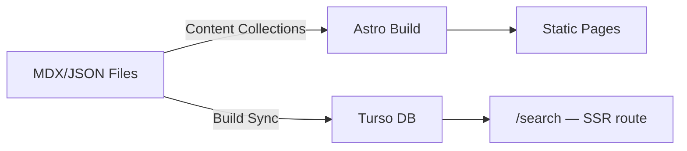
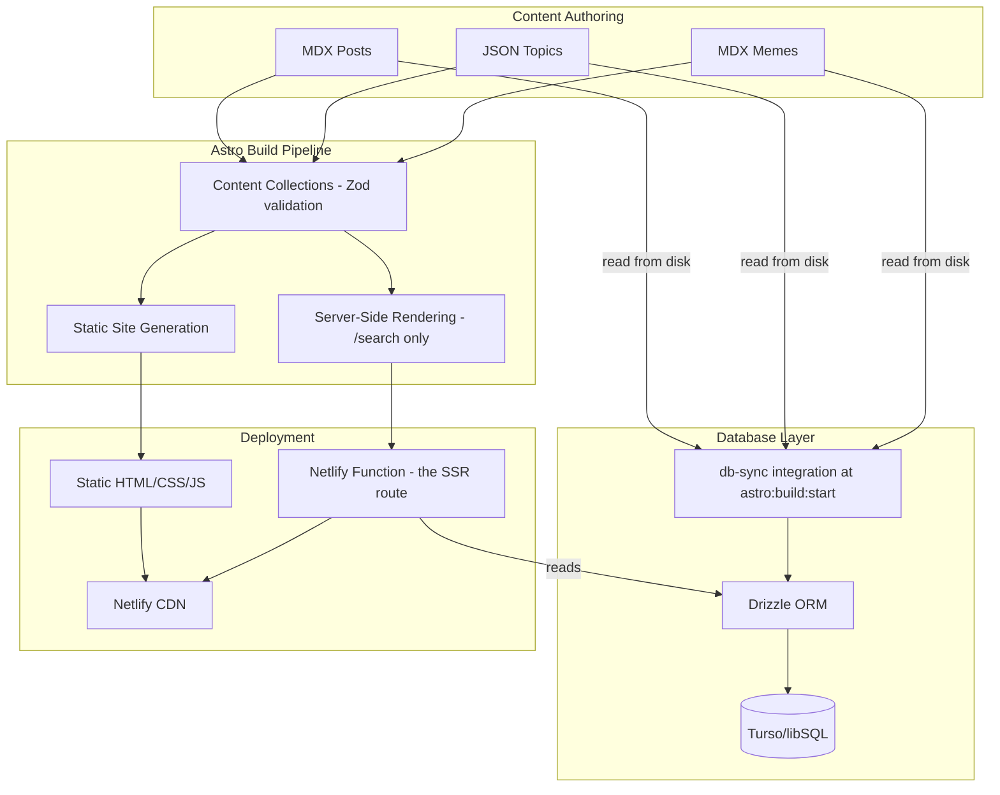
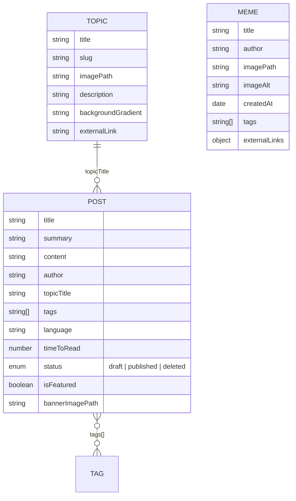
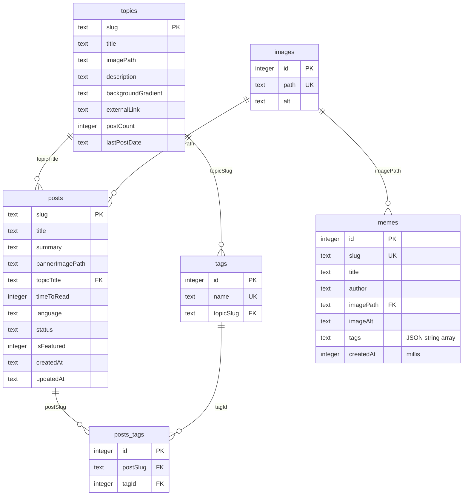
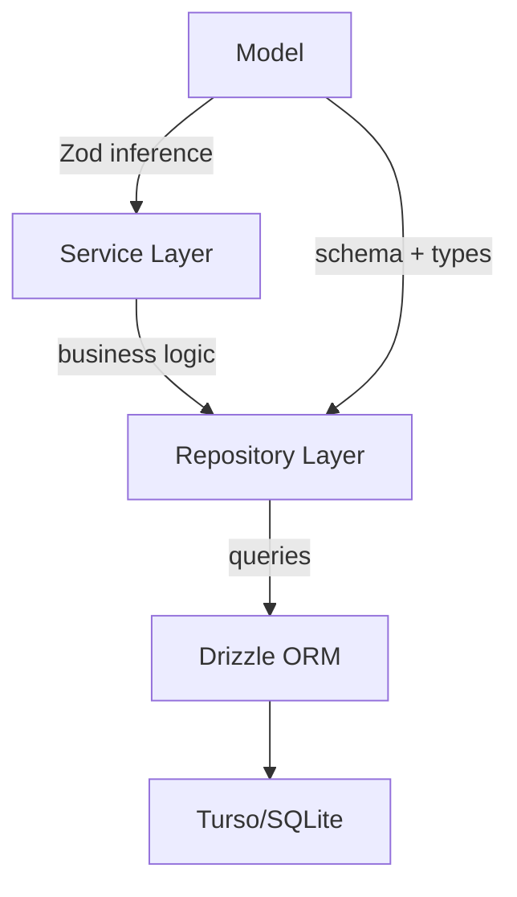
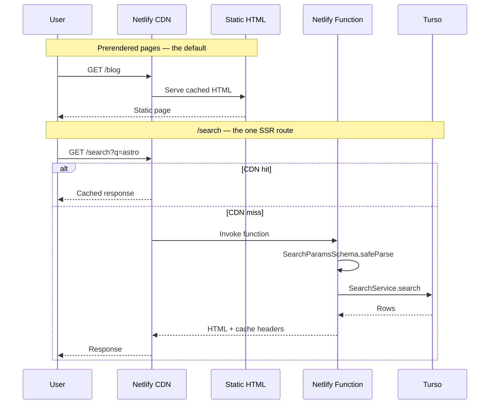
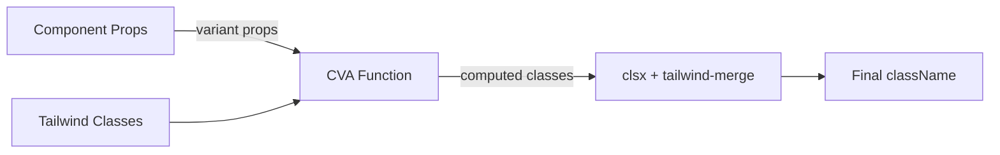
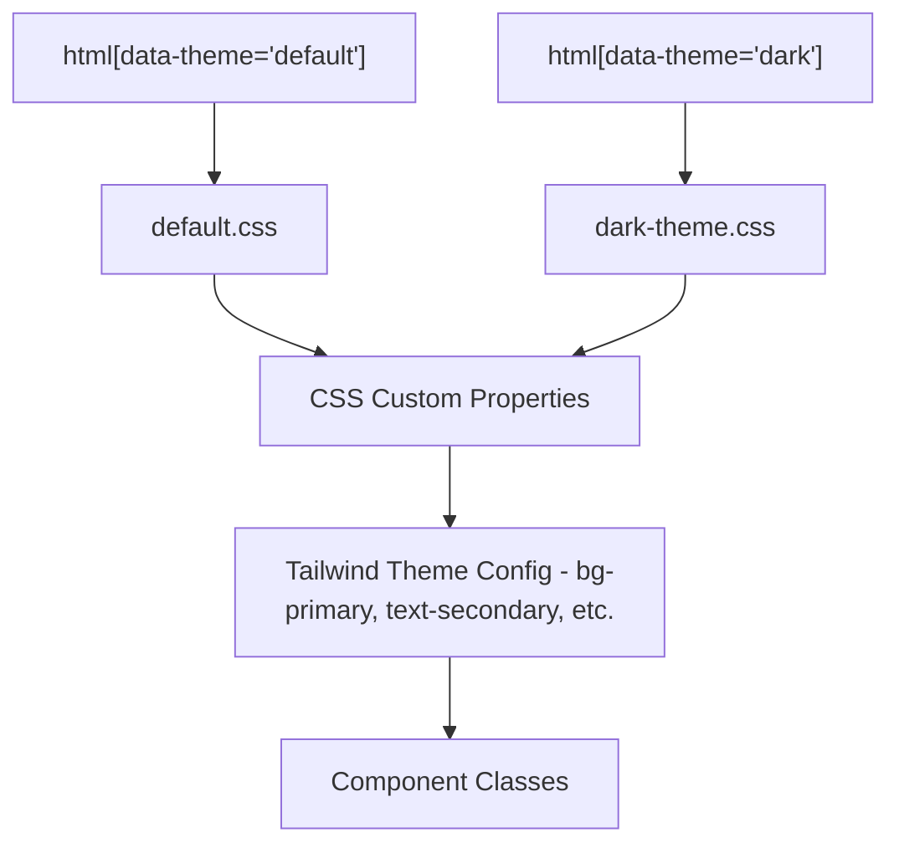

# Architecture Overview

## Source Layout

| Folder | Contents | Alias |
|---|---|---|
| `src/components/` | One folder per component, kebab-case dir, PascalCase `.astro` file | `@components/*` |
| `src/layouts/` | Page shells and content wrappers | `@layouts/*` |
| `src/content/` | MDX posts and memes, JSON topics — the source of truth | `@content/*` |
| `src/data/` | Plain TypeScript data modules (e.g. `projects.ts`) with no DB or IO | `@data/*` |
| `src/db/` | `client.ts`, `features/<entity>/`, `sync/`, `migrations/` | `@db/*` |
| `src/utils/` | Generic reusable helpers (json-ld, images, seo, logs) | `@utils/*` |
| `src/libs/` | Thin wrappers around external libraries (e.g. `cn`) | `@libs/*` |
| `src/types/` | Shared types and content-entity Zod schemas | `@typings/*` |
| `src/styles/` | Global CSS, themes, markdown styling | `@styles/*` |
| `src/assets/` | Images, icons and videos processed by Astro | `@assets/*` |

Aliases are declared in three places that must be kept in sync: `tsconfig.json`
`paths`, the import-sort group in `eslint.config.js`, and `vitest.config.ts`
`resolve.alias`.

`src/data/` holds static content that is neither a content collection nor
database-backed — the projects listing is the current example. Prefer it over
hardcoding arrays inside `.astro` frontmatter.

## Content Flow

Content is managed through Astro Content Collections (authoritative source) with
a sync to a Turso/SQLite database at build time for dynamic features:



## High-Level System Diagram



## Content Collections Schema



## Database Schema (Drizzle ORM)



## Database Layer (Repository/Service Pattern)

Each entity follows a three-layer pattern:



Files per entity in `src/db/features/`:
- `*.model.ts` — Drizzle schema + Zod types (via drizzle-zod)
- `*.repository.ts` — Database queries
- `*.service.ts` — Business logic wrapper

Entities: `posts`, `topics`, `tags`, `images`, `memes` — each a full
model/repository/service triple.

Service and repository objects are exported in PascalCase
(`PostsService`, `SearchRepository`, …) across every feature.

`memes` is written by the build-time sync and read by search; the meme *pages*
read the content collection directly, because the files are the source of
truth and the database is only the search index.

## Data Fetching

All data fetching goes through the **service layer** (`src/db/features/**/*.service.ts`).
Pages never query the database directly.

**Data flow:** `page frontmatter → service layer → repository layer → database`

- Service calls are only allowed inside `.astro` frontmatter
- ESLint rules enforce this: `*.service.ts` imports are blocked in `<script>` tags
- Each service file is organized by domain (topics, posts, tags, ...)

```ts
// In .astro frontmatter
import { TopicsService } from '@db/features/topics/topics.service';
const topicsWithImages = (await TopicsService.getAllTopicsWithImage()).filter(
  (topic) => (topic.postCount ?? 0) > 0,
);
```

## Request Flow

Every page is prerendered except `/search`, which sets `prerender = false` and
runs as a Netlify Function.



`/search` validates its query parameters with `SearchParamsSchema`
(`src/db/features/search/search.types.ts`) and returns a discriminated union —
a parse failure renders the page's error state rather than throwing.

Its responses are cached at the CDN with `Cache-Control`,
`Netlify-CDN-Cache-Control` and `Netlify-Vary`. The edge lifetime is a year
because the data only changes at deploy time and Netlify invalidates the
durable cache on every deploy; see the comment in `src/pages/search.astro`.

DB sync happens at build time via the `astro:build:start` hook, not at request
time. There are no API endpoints — `/search` is a page, not an endpoint, and
there is no `src/pages/api/` directory.

## Component Variant Pattern (CVA)

Components use `cva` (Class Variance Authority) for variant-based styling:



The pattern combines:
- `cva` for defining variant-to-class mappings
- `clsx` for conditional class composition
- `tailwind-merge` for deduplicating conflicting Tailwind classes

For components with only 1-2 conditional classes, prefer `class:list` over CVA.

```ts
// button.variants.ts
import { cva, type VariantProps } from 'class-variance-authority';
export const buttonVariants = cva('base-classes', { variants: { ... } });
export type ButtonVariants = VariantProps<typeof buttonVariants>;
```

## Theming System



Color allocation follows the **60-30-10 rule**:
- **60% Primary** - backgrounds, large surfaces
- **30% Secondary** - text, borders, structure
- **10% Accents** - CTAs, interactive elements, highlights
