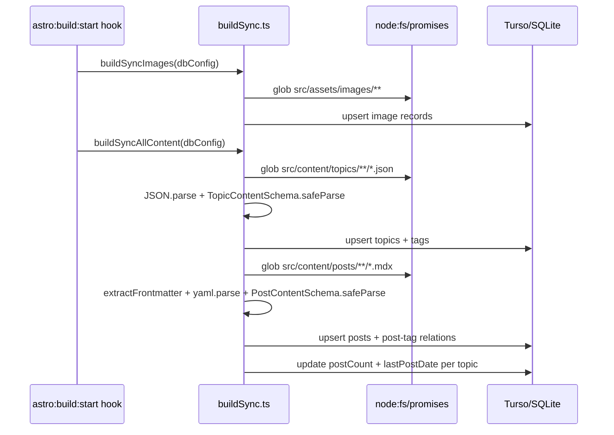
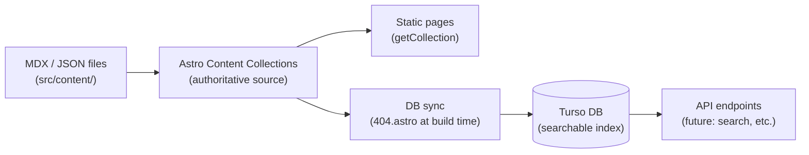

# Build & Dev Flow

## Quick Summary

```mermaid
flowchart TD
    subgraph DEV["Development (npm run astro:dev)"]
        D1[Astro dev server starts :4321]
        D2[Content Collections loaded on demand]
        D3[No DB sync — manual only]
        D1 --> D2 --> D3
    end

    subgraph BUILD["Production Build (npm run astro:build)"]
        B1["astro check (type-check)"]
        B2[astro build]
        B3["astro:build:start hook fires"]
        B4["buildSyncImages() — scan src/assets/images/ → DB"]
        B5["buildSyncAllContent() — topics, posts, analytics"]
        B6[Pages rendered]
        B7[Static HTML + serverless bundles output]
        B1 --> B2 --> B3 --> B4 --> B5 --> B6 --> B7
    end

    subgraph NETLIFY["Netlify Deployment"]
        N1["Build command: npm run astro:build"]
        N2[Static assets served from CDN]
        N3["API routes as Netlify Functions"]
        N1 --> N2
        N1 --> N3
    end
```



---

## Why DB Sync Uses the `astro:build:start` Hook

Sync is triggered via a custom Astro integration registered in `astro.config.mjs`.
The `astro:build:start` lifecycle hook fires before any page rendering, making it
the correct place for build-time side effects:

```js
// astro.config.mjs
{
  name: 'db-sync',
  hooks: {
    'astro:build:start': async ({ logger }) => {
      await buildSyncImages(dbConfig);
      await buildSyncAllContent(dbConfig);
    },
  },
}
```

The sync module (`buildSync.ts`) is Node-safe: it uses `node:fs/promises` glob and
the `yaml` package with Zod schema validation — no Vite or Astro virtual modules.

Environment variables are loaded via Vite's `loadEnv`, respecting `--mode`:

```js
// astro.config.mjs (module level)
const modeArgIdx = process.argv.indexOf('--mode');
const mode = modeArgIdx !== -1 ? process.argv[modeArgIdx + 1] : 'production';
const buildEnv = loadEnv(mode, process.cwd(), '');
```

This means `astro build --mode development` correctly loads `.env.development`.

---

## DB Sync Chain (`buildSyncAllContent`)



---

## Full Execution Order

### `npm run astro:dev` (development)

| Step | What happens |
|------|-------------|
| 1 | Vite dev server starts on `:4321` |
| 2 | Astro content collections loaded lazily per request |
| 3 | API endpoints available at `/api/v1/*` (no auth required in dev) |
| 4 | **No DB sync** — must trigger manually if needed |

DB operations in dev are all manual:
```bash
npm run db:migrate:local   # apply schema migrations
npm run drizzle:seed       # seed test data
npm run drizzle:studio     # open DB GUI

# on-demand sync (no auth token needed in dev):
curl -X POST http://localhost:4321/api/v1/topics
curl -X POST http://localhost:4321/api/v1/images
```

### `npm run astro:build` (production build)

| Step | What happens |
|------|-------------|
| 1 | `astro check` — full TypeScript type-check |
| 2 | Vite bundles assets, Tailwind processes CSS |
| 3 | Content collections validated against Zod schemas |
| 4 | **`astro:build:start` hook** → `buildSyncImages()` + `buildSyncAllContent()` |
| 5 | All pages rendered (use `getCollection()` for data) |
| 6 | Static output → `dist/` |
| 7 | SSR/API bundles → `dist/.server_javascript/` |
| 8 | Client JS/CSS → `dist/client_javascript_and_css/` |

### Netlify deployment

Netlify runs `npm run astro:build` as its build command. DB migrations are **not
automatic** — they must be run manually when the schema changes:

```bash
npm run db:migrate   # runs against production Turso via .env.production
```

---

## Local DB Setup (first time)

```bash
# 1. Apply the schema
npm run db:migrate:local

# 2. (Optional) seed test data
npm run drizzle:seed

# 3. Start dev server — connects directly to database/content.db
npm run astro:dev
```

No server process needed locally. `@libsql/client` reads `database/content.db`
directly via the `file:` URL scheme (`TURSO_DATABASE_URL=file:database/content.db`
in `.env.development`). Production uses the hosted Turso instance.

---

## Content Flow (Source of Truth)



The files are always the source of truth. The DB is a derived index populated at
build time — useful for future dynamic features like search.

---

## Local Build Modes

| Command | Mode | Env file loaded |
|---------|------|----------------|
| `npm run astro:build` | `production` | `.env`, `.env.production` |
| `npm run astro:build:local` | `development` | `.env`, `.env.development` |

`buildSync.ts` receives DB credentials via the `BuildSyncDbConfig` parameter
populated from `loadEnv` in `astro.config.mjs` — it does not read `process.env`
directly.

---

## Environment Variables

| Variable | Context | Access | Purpose |
|----------|---------|--------|---------|
| `BASE_SITE_URL` | client | public | Site URL |
| `SERVER_LOGS_LEVEL` | server | public | Server log verbosity |
| `CLIENT_LOGS_LEVEL` | client | public | Client log verbosity |
| `TURSO_DATABASE_URL` | server | secret | Database connection URL |
| `TURSO_AUTH_TOKEN` | server | secret | Database auth (optional locally) |

Local dev uses `.env.development`, production uses `.env.production`.
