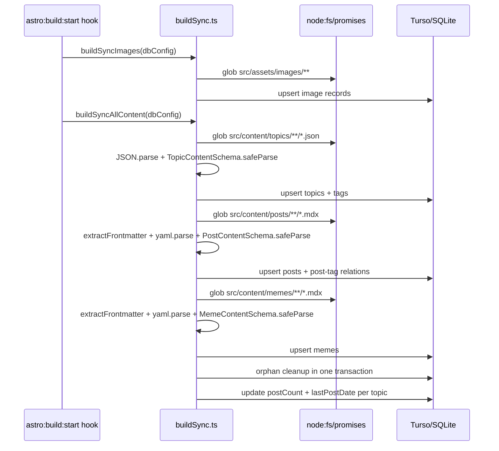
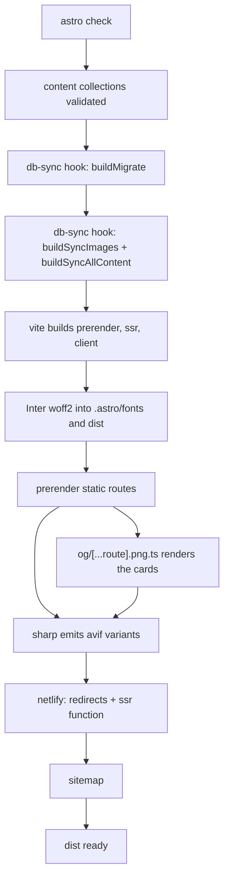
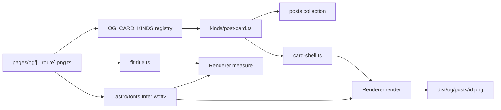
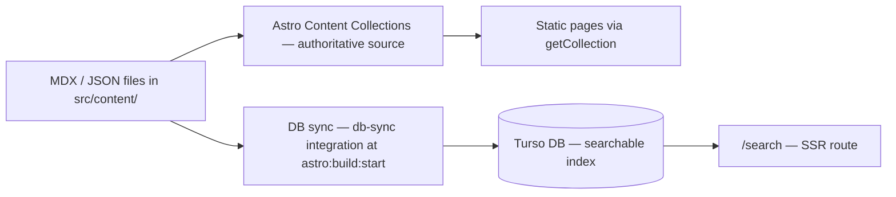

# Build & Dev Flow

## Quick Summary

```mermaid
flowchart TD
    subgraph DEV["Development (npm run astro:dev)"]
        D1[Astro dev server starts :4321]
        D2[Content Collections loaded on demand]
        D3[No DB sync — manual only]
        D1 --> D2 --> D3
    end

    subgraph BUILD["Production Build (npm run astro:build)"]
        B1["astro check (type-check)"]
        B2[astro build]
        B3["astro:build:start hook fires"]
        B4["buildSyncImages() — scan src/assets/images/ → DB"]
        B5["buildSyncAllContent() — topics, posts, memes, cleanup, analytics"]
        B6[Pages rendered]
        B7[Static HTML + serverless bundles output]
        B1 --> B2 --> B3 --> B4 --> B5 --> B6 --> B7
    end

    subgraph NETLIFY["Netlify Deployment"]
        N1["Build command: npm run astro:build"]
        N2[Static assets served from CDN]
        N3["One SSR route (/search) as a Netlify Function"]
        N1 --> N2
        N1 --> N3
    end
```



---

## Why DB Sync Uses the `astro:build:start` Hook

Sync is triggered via a custom Astro integration registered in `astro.config.mjs`.
The `astro:build:start` lifecycle hook fires before any page rendering, making it
the correct place for build-time side effects:

```js
// astro.config.mjs
{
  name: 'db-sync',
  hooks: {
    'astro:build:start': async ({ logger }) => {
      if ((buildEnv['DB_SYNC'] ?? 'run') === 'skip') return;
      await buildMigrate(dbConfig);
      await buildSyncImages(dbConfig);
      const syncResult = await buildSyncAllContent(dbConfig);
      if (!syncResult.success) throw new Error(/* aborts the build */);
    },
  },
}
```

The sync module (`buildSync.ts`) is Node-safe: it uses `node:fs/promises` glob and
the `yaml` package with Zod schema validation — no Vite or Astro virtual modules.

Environment variables are loaded via Vite's `loadEnv`, respecting `--mode`:

```js
// astro.config.mjs (module level)
const modeArgIdx = process.argv.indexOf('--mode');
const mode = modeArgIdx !== -1 ? process.argv[modeArgIdx + 1] : 'production';
const buildEnv = loadEnv(mode, process.cwd(), '');
```

This means `astro build --mode development` correctly loads `.env.development`.

---

## DB Sync Chain (`buildSyncAllContent`)



Orphan cleanup deletes rows whose files are gone from disk. It keys off which
files were **seen**, not which parsed successfully, so a post with broken
frontmatter keeps its row and its last good data; a topic file that cannot be
parsed skips topic cleanup for that run entirely, because a topic is identified
by a title stored inside the file.

---

## Full Execution Order

### `npm run astro:dev` (development)

| Step | What happens |
|------|-------------|
| 1 | Vite dev server starts on `:4321` |
| 2 | Astro content collections loaded lazily per request |
| 3 | `/search` runs server-side against the local DB; every other page is prerendered |
| 4 | `/og/posts/<id>.png` renders a card on request — see below |
| 5 | **No DB sync** — there is no dev-time sync trigger |

Pages read whatever the local database already contains. There is no endpoint
that syncs it — syncing happens on a build. DB operations in dev are all manual:

```bash
npm run drizzle:seed       # seed test data
npm run drizzle:studio     # open DB GUI
```

`npm run db:migrate:local` is currently broken (BUG-001) — run
`npm run astro:build:local` instead, which migrates through the `db-sync`
integration.

To refresh the local DB from `src/content/`, run a local build:

```bash
npm run astro:build:local  # migrates + syncs against .env.development
```

### `npm run astro:build` (production build)

Order taken from a real build log, not from intent.

| Step | Log line | What happens |
|------|----------|-------------|
| 1 | — | `astro check` — full TypeScript type-check |
| 2 | `[content] Syncing content` | Content collections read and validated against Zod schemas |
| 3 | `[types] Generated` | `.astro/types.d.ts` regenerated |
| 4 | `[db-sync] Running DB migrations...` | **`astro:build:start` hook** → `buildMigrate()` |
| 5 | `[db-sync] Starting DB sync...` | `buildSyncImages()` then `buildSyncAllContent()` — topics, posts, memes |
| 6 | `[build] Building server entrypoints...` | Vite builds the prerender, ssr and client environments |
| 7 | `[assets] Copying fonts` | Inter woff2 written from `.astro/fonts` into `dist` |
| 8 | `prerendering static routes` | Every static page **and `/og/posts/*.png`** rendered |
| 9 | `▶ /_astro/*.avif` | sharp generates the optimised image variants |
| 10 | `[@astrojs/netlify]` | `_redirects` emitted, SSR function bundled for `/search` |
| 11 | `[@astrojs/sitemap]` | `sitemap-index.xml` written |

Step 5 aborts the build if the content sync fails, rather than shipping a
half-written search index.



### OG card generation

The cards are prerendered like any other route, and depend on two earlier stages,
which is why their position in the order is not incidental:



- **Fonts** — the route reads the Inter woff2 from `.astro/fonts`. A missing font
  is a hard error, never a silent fallback to another face. `.astro/` is
  gitignored, so CI starts cold; verified that Astro populates it before
  prerendering, so a cold cache still produces cards.
- **Content** — the kind enumerates the `posts` collection, so content must be
  synced first.
- **Measurement and rendering use the same engine.** `Renderer.measure` gives the
  title's real wrapped height, so the fitted size cannot disagree with the drawn
  card.

Output is one unhashed PNG per published post at `dist/og/posts/<id>.png`. Adding
a card type means adding an entry to `OG_CARD_KINDS`; the route itself is
kind-agnostic.

#### Triggering it by hand

The route is a normal Astro endpoint, so the dev server renders it live:

```bash
npm run astro:dev
# then open, or curl:
open http://localhost:4321/og/posts/avoid-self-referencing-links.png
```

Each request re-renders from current content, so editing a post title and
reloading shows the new card immediately — no build needed. To produce the files
on disk instead:

```bash
npm run astro:build:local && open dist/og/posts/
```

### Netlify deployment

Netlify runs `npm run astro:build` as its build command.

**Migrations are automatic.** `buildMigrate()` runs in the `astro:build:start`
hook on every build, against whatever database the loaded env points at — so
deploying `main` migrates production Turso. There is nothing to run by hand.

The standalone `npm run db:migrate` and `db:migrate:local` scripts are currently
broken and are not part of this flow — see BUG-001 in `docs/issues/discovered.md`.

## Local DB Setup (first time)

```bash
# 1. Create and migrate the local DB, and sync content into it.
#    Not db:migrate:local — that script is broken (BUG-001). A local build
#    migrates through the db-sync integration and seeds from src/content/.
npm run astro:build:local

# 2. (Optional) seed extra test data
npm run drizzle:seed

# 3. Start dev server — connects directly to database/content.db
npm run astro:dev
```

No server process needed locally. `@libsql/client` reads `database/content.db`
directly via the `file:` URL scheme (`TURSO_DATABASE_URL=file:database/content.db`
in `.env.development`). Production uses the hosted Turso instance.

---

## Content Flow (Source of Truth)



The files are always the source of truth. The DB is a derived index populated at
build time, and `/search` is its only runtime consumer.

Note that the sync reads `src/content/` from disk directly (`node:fs/promises`
glob + `yaml`), not through the content collections — it runs in a plain Node
context where Astro's virtual modules are unavailable.

---

## Local Build Modes

| Command | Mode | Env file loaded |
|---------|------|----------------|
| `npm run astro:build` | `production` | `.env`, `.env.production` |
| `npm run astro:build:local` | `development` | `.env`, `.env.development` |

`buildSync.ts` receives DB credentials via the `BuildSyncDbConfig` parameter
populated from `loadEnv` in `astro.config.mjs` — it does not read `process.env`
directly.

### Building without touching a database

Every build migrates and rewrites whatever database the loaded env points at.
Set `DB_SYNC=skip` to make the `db-sync` integration a no-op:

```bash
DB_SYNC=skip npm run astro:build:local
```

The default is `run`, so production builds are unaffected. Use `skip` when you
want to verify that the site builds without mutating your local DB — or, with
`.env.production` loaded, without touching production.

---

## Environment Variables

| Variable | Context | Access | Purpose |
|----------|---------|--------|---------|
| `BASE_SITE_URL` | client | public | Site URL |
| `SERVER_LOGS_LEVEL` | server | public | Server log verbosity |
| `CLIENT_LOGS_LEVEL` | client | public | Client log verbosity |
| `TURSO_DATABASE_URL` | server | secret | Database connection URL |
| `TURSO_AUTH_TOKEN` | server | secret | Database auth (optional locally) |
| `DB_SYNC` | server | public | `run` (default) or `skip` — gates the build-time sync |

Local dev uses `.env.development`, production uses `.env.production`.
`.env.example` at the repo root lists all of them with placeholder values.

