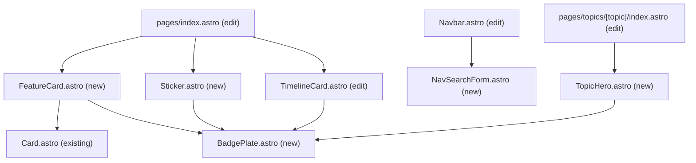

# UI Redesign — Design Spec

Validated design for three UI surfaces. Every decision below was reviewed
against rendered mockups using the real design tokens.

## Context

The site runs on Astro 7.2.0. Three surfaces have accumulated problems that are
visual, not functional:

- The **topic hero** blows the topic logo up to `h-[200%]` inside a fixed
  `25dvh`/`35dvh` box, so it bleeds and reads as noise while an opaque plate
  covers the image it is meant to sit in.
- The **homepage** uses bare emoji as section marks, with no container, dead
  `text-white` classes, OS-dependent rendering and no `aria-hidden`.
- The **navbar** renders six equal-weight links, one of which — Search — is an
  action styled as a content destination.

This spec covers only those three. It is the first of four planned workstreams;
the others get their own spec cycles.

| Workstream | Status |
|-----------|--------|
| **A — UI redesign (this spec)** | designed |
| B — build-time OG image generation | not started |
| C — image and page-load performance | not started |
| D — duck character baseline doc | not started |

**Out of scope.** Dark theme stays untouched: `src/styles/themes/dark-theme.css`
is a non-functional stub (`--color-primary: fuchsia`, no accent ramps, no
toggle, unreachable at runtime). Everything here is designed against the light
palette only.

## Design constraints

From `docs/stable/development/styling/design-system.md`, unchanged: thick
visible borders, flat comic shadows with no blur or gradients, saturated accents
on a light ground, blocky layouts, Inter. Tokens `primary #f4f0fa`,
`secondary #00020a`, `accent #ff3de9`, `accent2 #3de9ff`, `accent3 #e9ff3d`.
Utilities `border-comic` (2px), `border-comic-thick` (4px),
`shadow-comic{,-lg,-xl,-pressed}`. No React — `.astro` only. CVA for
multi-variant components, `class:list` for one or two conditionals.

## Component structure



### BadgePlate — the shared primitive

Every mark on all three surfaces is one of these, which is what makes the
surfaces read as one system. It is a plate, not an icon wrapper: the content is a
`<slot>`, so the same component holds an `astro-icon` glyph, an `<Image>`, or a
monogram letter.

Base classes: `bg-primary-100 border-comic border-secondary shadow-comic`,
`grid place-items-center`, `overflow-hidden`.

CVA variants:

| Variant | Values | Used by |
|---------|--------|---------|
| `size` | `sm` 40px · `md` 56px · `lg` 80px · `xl` 96px | sticker · feature card · timeline (mobile) · timeline and topic hero |
| `shape` | `square` (`rounded-lg`) · `round` (`rounded-full`) | all but the sticker · the sticker |
| `weight` | `default` (2px + `shadow-comic`) · `heavy` (4px + `shadow-comic-lg`) | feature card and sticker · topic hero and timeline |

Per CLAUDE.md this is a domain-agnostic primitive, so it sits at the same level
as `Button`, `Card`, `Link` and `Tag` — `src/components/badge-plate/`.

---

## Surface 1 — Topic hero

Replaces `src/pages/topics/[topic]/index.astro:203-237` with a new
`src/components/topic-hero/TopicHero.astro`.

### Layout

Horizontal band: tilted logo plate on the left, text block on the right.

- Container: `border-comic-thick border-secondary shadow-comic-lg`, padding
  `p-6`, `overflow-hidden`, **no fixed height**. Height is content-driven — this
  is what removes the `25dvh`/`35dvh` cropping problem entirely.
- Logo plate: `BadgePlate` at `size="xl" shape="square" weight="heavy"` plus
  `rotate-[-3deg]`, containing the topic image at 62px with `object-contain`.
  The image is never scaled beyond its plate.
- Text block: `<h1>` at `text-4xl md:text-5xl font-extrabold`, then the topic
  description as a paragraph, then a row of metadata pills.
- The description **moves inside the hero**. The separate gradient `<p>` below
  it is removed.
- Metadata pills: post count and last-updated date. Both values already exist on
  `topicsTable` as `postCount` and `lastPostDate`
  (`src/db/features/topics/topics.model.ts`) — no new queries needed. Render
  `lastPostDate` only when non-null. Styled as
  `border-comic border-secondary shadow-comic rounded-full px-3`.

Below `sm`, plate and text stack vertically. The plate keeps its 96px size, the
`<h1>` drops to `text-3xl`.

### Texture

A pure-CSS dot grid, applied to an absolutely positioned layer inside the hero
(not to the hero itself — a mask on the container would clip its own border and
children):

```css
background-image: radial-gradient(var(--color-secondary) 1.6px, transparent 1.7px);
background-size: 14px 14px;
mask-image: linear-gradient(to right, #000 0%, #000 12%, transparent 34%);
```

Dots sit solid across the logo column and are gone before the text starts —
"linear wipe". Zero image weight, zero extra requests, nothing to bleed.

Mobile re-anchor: when the layout stacks, the mask must become
`linear-gradient(to bottom, …)` with the same stops, otherwise the dots land on
the copy. One media query.

### Colour — derived from the topic's own brand colour

`TopicContentSchema` gains an optional base colour and loses
`backgroundGradient`:

```ts
accentColor: z.string().regex(/^#[0-9a-fA-F]{6}$/).optional(),
```

Keep the file's existing `astro/zod` import. Unifying the codebase on plain
`zod` is CLEANUP-001 and stays out of scope here.

Injected as a CSS custom property with `define:vars`, then everything derives
from it:

| Element | Value |
|---------|-------|
| Band background | `color-mix(in oklab, var(--topic-accent) 20%, white)` |
| Metadata pills | `color-mix(in oklab, var(--topic-accent) 55%, white)` |
| Fallback when absent | `var(--color-accent2)` |

The 20% mix guarantees a light surface from any input, so `secondary` text
always meets contrast — validated in the mockup against six real brand hexes
spanning orange, cyan, blue, purple, red and amber.

Chosen because it is free-form as required, Zod-validated, and needs no Tailwind
class discovery. Raw class strings in content JSON were rejected: nothing
validates them, contrast can break silently, and the classes only exist if
Tailwind's scanner finds them. Build-time colour extraction from the logo was
rejected for loss of control.

### Schema ripple

Replacing `backgroundGradient` with `accentColor` touches more than the hero.
All of these must change together:

| File | Change |
|------|--------|
| `src/types/entities/topicContent.entity.ts` | replace the field |
| `src/content/topics/*.json` (6 files) | replace with a real brand hex |
| `src/db/features/topics/topics.model.ts` | `backgroundGradient` → `accentColor` column |
| `src/db/migrations/` | new `0002_*` migration, generated with `npm run drizzle:generate_migrations` |
| `src/db/sync/buildSync.ts` (~lines 194, 204-205) | field name in the upsert and the change comparison |
| `src/components/card/TopicCard.astro` | three prop declarations and two `<Image>` class usages |
| `src/pages/topics/index.astro:155` | prop passed to `TopicCard` |

`TopicCard` moves to the same `color-mix` treatment so the index tiles and the
hero agree. The migration is applied by `buildMigrate` at build start, which on
`main` means it runs against production Turso on deploy.

Five of the six topic JSONs currently have `backgroundGradient: ""`, so only
`astro.json` loses real configuration.

---

## Surface 2 — Homepage

### "What I do" — icon badge plus ghosted numeral

New `src/components/card/FeatureCard.astro` wrapping the existing `Card`,
replacing the three hardcoded blocks at `src/pages/index.astro:211-252`.

- Mark: a `BadgePlate` at `size="md" shape="square"`, top-left, above the
  heading.
- Numeral: a `16rem` `font-black` digit, solid-filled at
  `color-mix(in oklab, var(--color-secondary) 7%, transparent)`, absolutely
  positioned to bleed off the **bottom-right** corner. Most of the glyph is
  outside the card, so it reads as a texture wash rather than a number.
  `aria-hidden`, `select-none`, `pointer-events-none`, `z-0`, with card content
  at `z-10`. Relies on the `overflow-hidden` already present on `Card`.
- Card fills stay as they are: `bg-accent-100`, `bg-accent2-100`,
  `bg-accent3-100`, with the first card spanning both columns.

Outlined and accent-tinted numerals, top-left placement and badge-overlap
placements were all tried and rejected: an outlined numeral is the same visual
material as a stroked icon, so overlapping the two muddies both.

### "Fun facts" — sticker scatter

New `src/components/sticker/Sticker.astro` replaces
`src/components/card/FunfactCard.astro`, which is deleted.

- A pill: `border-[3px] border-secondary shadow-comic-lg rounded-full`, padding
  `py-2 pr-4 pl-2`, holding a `BadgePlate` at `size="sm" shape="round"` plus a
  bold title and a small description.
- Container is `flex flex-wrap justify-center gap-4` — not a fixed grid, so any
  number of facts wraps naturally.
- Rotation is cosmetic, cycling with `:nth-child(4n+1)` … `:nth-child(4n)` at
  −3°, 2°, −1.5°, 3°. Cycling rather than fixed indices means a fifth fact keeps
  working.
- The `#fun-facts > div > :nth-child(1..4)` float animation in
  `src/pages/index.astro:362-399` is **deleted**. It is keyed to positional
  selectors and silently stops working at a fifth card. Replaced by
  `hover:-rotate-1` on the sticker, which needs no positional selectors and no
  `prefers-reduced-motion` exception.

Accepted trade-off: at desktop width all four stickers fit on one line, so it
reads as a tidy badge row rather than a true scatter. Confirmed acceptable. A
desktop-only comic-panel skin was designed and considered — it shares the same
DOM and only swaps CSS — but was not adopted; it stays available if the row ever
feels too plain.

### Icon set

All from `@iconify-json/mdi`, already installed. Every name below was verified
against `node_modules/@iconify-json/mdi/icons.json` — all eleven resolve, none
are aliases. `mdi:magnify` (the search field's leading icon) is included in that
check.

| Where | Item | Icon |
|-------|------|------|
| What I do | Frontend Engineering | `mdi:code-braces` |
| What I do | End-to-end Development | `mdi:server` |
| What I do | Projects and Writing | `mdi:pencil-ruler` |
| Fun facts | Gardener | `mdi:chili-hot` |
| Fun facts | Gamer | `mdi:gamepad-variant` |
| Fun facts | Learner | `mdi:book-open-page-variant` |
| Fun facts | Duck lover | `mdi:duck` |
| Timeline | Developer role | `mdi:briefcase` |
| Timeline | Internship | `mdi:seed` |
| Timeline | Degree | `mdi:school` |

`mdi:chili-hot` replaces the more obvious `mdi:sprout` for Gardener for two
reasons: it matches the actual copy ("Hot peppers enjoyer") far more precisely,
and it avoids putting two plant marks — `sprout` and the timeline's `seed` — on
the same page.

`mdi:duck` is already wrapped as `src/components/icons/duck-icon/DuckIcon.astro`
and used as an end-of-list marker on `/blog` and topic pages — reuse it.

`astro.config.mjs` sets `icon({ iconDir: 'src/assets/icons' })` against a
directory that does not exist (CLEANUP-007). Either create it for local SVGs or
drop the option; do not leave it dangling.

### Timeline marks — kind icons

`src/components/card/TimelineCard.astro` marks each entry by **what kind of
entry it is**, not by which organisation. The organisation is already named in
the `place` pill directly beneath, so a logo would be redundant.

- The `h-20 w-20 rounded-xl` wrapper currently has no background or border — an
  invisible container. It becomes a `BadgePlate` at `size="lg" weight="heavy"`,
  stepping up to `size="xl"` at `md`, matching the existing
  `h-20 w-20 md:h-24 md:w-24` sizing.
- Contents: one `astro-icon` glyph per the table above. Same badge vocabulary as
  every other mark on the page.
- The `logo?: string` emoji branch and its `text-6xl … text-white` span are
  removed. The `logo?: { src, alt, … }` object branch **stays** — it costs
  nothing and means a real organisation logo can be dropped in per-entry later
  without touching the icon path.

**No third-party artwork is reproduced**, so there is no trademark or copyright
question to resolve and nothing blocks implementation. Organisation monograms and
a monogram-plus-notched-icon hybrid were both designed and rejected: the monogram
duplicates what the `place` pill already says, and the hybrid's corner notch is a
shape that appears nowhere else in the redesign.

### Emoji retained deliberately

Emoji in prose and button labels stay: hero copy 🇮🇹 / 😃
(`src/pages/index.astro:168, 175`) and the CTA labels "Explore my projects 🚀" /
"Read the blog 📝" (lines 178-183, 325-338). These are voice, not structural
marks. Only the structural emoji — section marks and timeline logos — are
replaced.

---

## Surface 3 — Navbar and search

### Nav links

All five links stay. Label and slug diverge for one of them.

- `NAV_ITEMS` in `src/components/navbar/Navbar.astro:15-22` loses the `/search`
  entry and renames the projects label: `{ href: '/my-projects', label: 'Projects' }`.
  The slug is unchanged; only the label shortens, at **every** breakpoint.
- No separator glyph. `gap-x-[1.6rem]` between items and nothing else.
  Bullet-between-all was rejected as crowded; bullet-between-groups was rejected
  because it leaves Blog / Topics / Memes running together, which was the
  original complaint; per-link chips and uppercase tracking were rejected as too
  heavy and too corporate respectively.
- Active page: magenta underline, `decoration-accent decoration-[3px]
  underline-offset-[6px]`.

**Implementation note that matters.** `Link.astro` already renders a
`<span aria-current='page'>` instead of an `<a>` for self-referencing links. The
active style must therefore target that span, not `a`. Getting this wrong means
the active state silently never appears.

### Search — a real GET form

New `src/components/search/NavSearchForm.astro`, used by both the desktop bar
and the mobile drawer.

```html
<form action="/search" method="get" role="search">
  <label class="sr-only" for="nav-q">Search posts and memes</label>
  <input id="nav-q" name="q" type="search" placeholder="Search posts and memes…">
</form>
```

The field is always visible, never collapses, and needs **no JavaScript**. This
matches what the backend actually does: `src/pages/search.astro` is
`prerender = false`, runs `LIKE '%…%'` SQL, and every query is a full page
navigation. The current client script only rewrites an anchor's `href`.

- Position: far right of the bar, after a `w-[2px] bg-secondary` divider.
- Surface: `bg-primary-100 border-comic border-secondary shadow-comic
  rounded-lg`, with a leading `mdi:magnify` icon.
- Responsive width — the field shrinks, it does not become a button:

  | Breakpoint | Width | Placeholder |
  |-----------|-------|-------------|
  | `xl` | 250px | "Search posts and memes…" |
  | `lg` | 180px | "Search…" |
  | `md` | 120px | "Search…" |

  At `md` the brand wordmark also drops to the logo alone. That is what buys the
  room. Below `md` the bar is the hamburger and drawer, as today.

An icon-only expanding button, a two-tier header and a centre `⌘K` command bar
were all rejected — respectively for discoverability, for permanent sticky-height
cost, and for promising live results the SSR backend does not provide.

**No keyboard shortcut.** The `/`-to-focus hint was designed and explicitly
dropped: no listener, no `kbd` chip, no `preventDefault` handling.

### Mobile drawer

Order inside `<dialog id='nav-dialog'>`, top to bottom:

1. Brand mark and wordmark
2. The five nav links
3. Flexible spacer
4. `NavSearchForm`, full width
5. The existing swipe-tip paragraph — stays the last element

Search sits low for one-handed thumb reach. Two known consequences, neither a
blocker:

- The drawer is `h-dvh`, so focusing the field brings up the on-screen keyboard
  over roughly the bottom half and the browser scrolls the field into view,
  shifting the whole drawer.
- The two-line swipe tip pushes the field up about 34px. Trimming that copy to
  one line would recover the reach.

---

## Bugs fixed along the way

These are pre-existing defects in the code being rewritten. Fixing them is part
of the work, not scope creep.

| Location | Defect |
|----------|--------|
| `topics/[topic]/index.astro:207` | `text-8` is not a Tailwind class — dead |
| `topics/[topic]/index.astro:204` | `flex-col` on a `grid` container — dead |
| `index.astro:217, 229, 241` | `text-white` on emoji spans — emoji ignore `color` |
| `index.astro` emoji marks | no `aria-hidden`, so screen readers announce "atom symbol, gear, rocket" |
| `FunfactCard.astro` | 16×16 `rounded-full` wrapper with no background or border — an invisible sizing box |
| `TimelineCard.astro:50` | same invisible-container problem on the logo box |
| `index.astro:362-399` | float animation keyed to `:nth-child(1..4)`, breaks at a fifth fact |
| `search.astro:276-491` | the entire search grid — divs, sections, aside, dialogs — is nested inside a `<p>`. The browser auto-closes the `<p>`, so the DOM does not match the source. Opportunistic fix while touching search. |

## Accessibility

- Every icon is decorative: `aria-hidden="true"`, meaning carried by adjacent
  text.
- The ghosted numeral is `aria-hidden`, `select-none`, `pointer-events-none`.
- The search form has `role="search"` and a visually hidden `<label>`.
- Active nav state uses the existing `aria-current='page'` span from
  `Link.astro`.
- Sticker rotations are static transforms, so no `prefers-reduced-motion`
  exception is needed once the float animation is gone.
- Contrast: the 20% colour-mix band keeps `secondary` text well above 4.5:1 for
  any input hex.

## Files touched

**New**

```
src/components/badge-plate/BadgePlate.astro
src/components/topic-hero/TopicHero.astro
src/components/card/FeatureCard.astro
src/components/sticker/Sticker.astro
src/components/search/NavSearchForm.astro
src/data/what-i-do.ts
src/data/fun-facts.ts
src/db/migrations/0002_*.sql
```

`src/data/` already exists and holds `projects.ts`, consumed as `@data/projects`
— the two new data modules follow that pattern, moving the `funFacts` and
"what I do" content out of `index.astro`.

**Edited**

```
src/pages/index.astro
src/pages/topics/[topic]/index.astro
src/pages/topics/index.astro
src/components/navbar/Navbar.astro
src/layouts/header/Header.astro
src/components/card/TimelineCard.astro
src/components/card/TopicCard.astro
src/types/entities/topicContent.entity.ts
src/db/features/topics/topics.model.ts
src/db/sync/buildSync.ts
src/content/topics/*.json
src/pages/search.astro
docs/stable/development/styling/design-system.md
docs/issues/discovered.md
```

**Deleted**

```
src/components/card/FunfactCard.astro
```

`src/layouts/header/Header.astro` is in the list for two reasons: it owns the
brand mark that drops to logo-only at `md`, and it is where the nav dialog
scripts are wired (`src/utils/scripts/navDialog.ts`,
`swipeToToggleDialog.ts`) — the drawer's new contents must not break either.

Documentation is part of the change: `design-system.md` gains the badge-plate and
sticker surface patterns, and `discovered.md` loses CLEANUP-007 if `iconDir` is
resolved.

## Verification

1. `npm run astro:check` clean, `npm run lint` clean, `npm run format:check`
   clean.
2. `npm run db:migrate:local` then `npm run astro:build:local` — confirms the
   `0002` migration applies and `buildSyncAllContent` writes `accentColor`
   without errors.
3. `npm run astro:dev`, then check by eye:
   - all six topic pages — band colour derives correctly, dots wipe before the
     text, nothing crops, the fallback works for any topic left without a hex
   - the homepage — three feature cards, ghosted numerals bleeding bottom-right,
     four stickers wrapping
   - the timeline — briefcase, seed and graduation-cap plates, no emoji left
4. Resize the navbar through 1440 / 976 / 768 / 375 px. Confirm the field
   shrinks rather than collapsing, the wordmark drops at `md`, and the drawer
   takes over below `md`.
5. Submit the nav search form **with JavaScript disabled**. It must navigate to
   `/search?q=…` and return results.
6. Navigate the header by keyboard only; confirm the active page is announced
   via `aria-current` and every icon is skipped by the screen reader.
7. Lighthouse on `/`, `/topics/astro` and `/blog` — no regression against the
   pre-change numbers. Capture the baseline before starting.

## Follow-ups, deliberately not in this spec

- Real organisation logos, if you ever get written permission. The `logo` object
  branch on `TimelineCard` is retained precisely so this needs no redesign.
- Choosing the six `accentColor` hexes is a content decision, not a code one.
- The desktop comic-panel skin for Fun facts remains designed but unadopted.
- Workstreams B, C and D each get their own spec.
